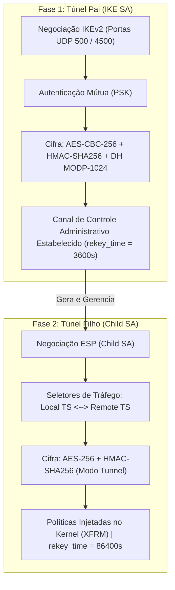

# VPN IPsec strongSwan Ponto a Ponto (Matriz × Filial)

[](https://rockylinux.org/)
[](https://www.strongswan.org/)
[](https://datatracker.ietf.org/doc/html/rfc7296)
[](https://www.linux-kvm.org/)
[](LICENSE)

> **Autor:** Rafael da Silva Siqueira  
> *Analista de Infraestrutura e Implantação de Sistemas*  
> Documentação técnica e repositório de automação para provisionamento, configuração e homologação de uma VPN IPsec IKEv2 pura ponto a ponto com arquitetura desacoplada via `swanctl`.

---

## Sumário
1. [Objetivos do Projeto](#1-objetivos-do-projeto)
2. [Conceitos Fundamentais: IKEv2 (Pai & Filho)](#2-conceitos-fundamentais-ikev2-pai--filho)
3. [Topologia de Rede & Especificações](#3-topologia-de-rede--especificações)
4. [Estrutura do Repositório](#4-estrutura-do-repositório)
5. [Preparação do Sistema Operacional](#5-preparação-do-sistema-operacional)
6. [Configurações do strongSwan (swanctl)](#6-configurações-do-strongswan-swanctl)
7. [Regras de Firewall (iptables)](#7-regras-de-firewall-iptables)
8. [Carga, Testes e Validação Operacional](#8-carga-testes-e-validação-operacional)
9. [Guia de Operação e Troubleshooting](#9-guia-de-operação-e-troubleshooting)
10. [Material de Apresentação](#10-material-de-apresentação)

---

## 1. Objetivos do Projeto

Interligar com segurança, escalabilidade e custo zero de royalties as redes corporativas da **Matriz** e da **Filial**, implementando **IKEv2 puro com criptografia AES-256** em gateways de borda Rocky Linux 9 virtualizados sobre KVM / Virt-Manager.

### Pilares de Negócio & Arquitetura
* **Criptografia em Trânsito:** Blindagem AES-256 de ponta a ponta sobre links públicos ou redes inseguras.
* **Vantagem Open Source:** Zero custo de royalties utilizando strongSwan moderno (`swanctl`), garantindo total independência de fornecedor (*anti-vendor lock-in*).
* **Redução de CapEx & OpEx:** Elimina appliances de rede proprietários de alto custo e licenciamento recorrente por túnel ou throughput.

---

## 2. Conceitos Fundamentais: IKEv2 (Pai & Filho)

O protocolo **IKEv2 (RFC 7296)** opera em um modelo hierárquico desacoplado em duas fases essenciais:



### 2.1. Túnel Pai (IKE SA)
* **Função:** Canal blindado de gestão e controle administrativo.
* **Responsabilidade:** Autenticar os dois gateways e negociar parâmetros criptográficos e chaves de sessão sem expor dados.
* **Tráfego:** Mensagens de controle exclusivas nas portas **UDP 500** (IKE) e **UDP 4500** (NAT-Traversal / NAT-T).
* **Segurança:** Ciclo de renovação periódico (`rekey_time = 3600s`) para limitar janelas de criptoanálise.

### 2.2. Túnel Filho (Child SA)
* **Função:** Rodovia operacional de transporte de dados corporativos (Protocolo ESP).
* **Responsabilidade:** Criptografar, autenticar e encapsular os pacotes reais entre as sub-redes locais (LANs) em modo **Tunnel**.
* **Escalabilidade & Performance:** Políticas injetadas nativamente no subsistema **XFRM do Kernel Linux**, proporcionando altíssimo throughput com proteção contra replay attacks.
* **Governança de Conexão:**
  * **Matriz Ativa (`start_action = start`):** Dispara a iniciação do túnel na inicialização.
  * **Filial Sob Demanda (`start_action = trap`):** Aguarda o disparo por tráfego ou inicialização remota, prevenindo concorrência e SAs duplicadas.
  * **Detecção de Queda (`dpd_action = restart`):** O Dead Peer Detection detecta falhas de enlace e restabelece a sessão automaticamente.

---

## 3. Topologia de Rede & Especificações

```
┌──────────────────────────────────────┐                   ┌──────────────────────────────────────┐
│            gateway-matriz            │                   │            gateway-filial            │
│                                      │                   │                                      │
│  LAN: 192.168.10.1/24 (enp1s0)       │                   │  LAN: 192.168.20.1/24 (enp1s0)       │
│  WAN: 192.168.122.24  (enp2s0)       │                   │  WAN: 192.168.122.48  (enp2s0)       │
└──────────────────┬───────────────────┘                   └───────────────────┬──────────────────┘
                   │                                                           │
                   └────────────────── [ Túnel IPsec IKEv2 / ESP ] ────────────┘
```

| Parâmetro | Lado A: Gateway Matriz | Lado B: Gateway Filial |
| :--- | :--- | :--- |
| **Hostname** | `gateway-matriz` | `gateway-filial` |
| **Sistema Operacional** | Rocky Linux 9 (x86_64) | Rocky Linux 9 (x86_64) |
| **Plataforma de Virtualização** | KVM / QEMU / Virt-Manager | KVM / QEMU / Virt-Manager |
| **Interface WAN (`enp2s0`)** | `192.168.122.24/24` | `192.168.122.48/24` |
| **Interface LAN (`enp1s0`)** | `192.168.10.1/24` | `192.168.20.1/24` |
| **Sub-rede Local (`local_ts`)** | `192.168.10.0/24` | `192.168.20.0/24` |
| **Sub-rede Remota (`remote_ts`)** | `192.168.20.0/24` | `192.168.10.0/24` |
| **Nome da Conexão / Child SA** | `matriz-to-filial` | `filial-to-matriz` |
| **Papel na Inicialização** | Ativo (`start_action = start`) | Passivo / Trap (`start_action = trap`) |

---

## 4. Estrutura do Repositório

```
.
├── LICENSE
├── README.md
├── .gitignore
├── config/
│   ├── gateway-matriz/
│   │   ├── iptables-rules.sh
│   │   └── swanctl/
│   │       └── conf.d/
│   │           ├── matriz-to-filial.conf
│   │           └── matriz-to-filial-secrets.conf.example
│   └── gateway-filial/
│       ├── iptables-rules.sh
│       └── swanctl/
│           └── conf.d/
│               ├── filial-to-matriz.conf
│               └── filial-to-matriz-secrets.conf.example
├── docs/
│   └── presentation/
│       ├── VPN-IPsec-strongSwan-Matriz-Filial.pdf
│       └── VPN-IPsec-strongSwan-Matriz-Filial.pptx
└── scripts/
    ├── setup-gateway.sh
    └── test-connectivity.sh
```

---

## 5. Preparação do Sistema Operacional

Execute os comandos a seguir em ambos os nós de borda (`gateway-matriz` e `gateway-filial`), ou utilize o script automatizado [`scripts/setup-gateway.sh`](scripts/setup-gateway.sh):

```bash
# 1. Habilitar repasse de pacotes IPv4 no Kernel
echo "net.ipv4.ip_forward = 1" | sudo tee /etc/sysctl.d/99-ipforward.conf
sudo sysctl -p /etc/sysctl.d/99-ipforward.conf

# 2. Desativar firewalld (padronizando para iptables-services)
sudo systemctl stop firewalld
sudo systemctl disable firewalld

# 3. Instalar repositorio EPEL, strongSwan e iptables
sudo dnf install -y epel-release
sudo dnf install -y strongswan iptables-services

# 4. Habilitar e iniciar os serviços
sudo systemctl enable --now iptables
sudo systemctl enable --now strongswan
```

---

## 6. Configurações do strongSwan (`swanctl`)

O strongSwan moderno adota uma arquitetura desacoplada via `swanctl`:
* Arquivos `.conf` definem conexões, algoritmos e seletores de tráfego.
* Arquivos `-secrets.conf` contêm as chaves pré-compartilhadas (PSK) com permissões estritas (`chmod 600`).

### 6.1. Gateway Matriz (`gateway-matriz`)

Arquivo [`config/gateway-matriz/swanctl/conf.d/matriz-to-filial.conf`](config/gateway-matriz/swanctl/conf.d/matriz-to-filial.conf):

```hocon
connections {
    matriz-to-filial {
        version = 2
        local_addrs = 192.168.122.24
        remote_addrs = 192.168.122.48

        local {
            auth = psk
            id = 192.168.122.24
        }
        remote {
            auth = psk
            id = 192.168.122.48
        }

        proposals = aes256-sha256-modp1024
        rekey_time = 3600s

        children {
            matriz-to-filial {
                local_ts  = 192.168.10.0/24
                remote_ts = 192.168.20.0/24
                esp_proposals = aes256-sha256-modp1024
                rekey_time = 86400s
                mode = tunnel
                start_action = start
                dpd_action = restart
                updown = /usr/libexec/strongswan/_updown iptables
            }
        }
    }
}
```

Arquivo de Credenciais (`/etc/strongswan/swanctl/conf.d/matriz-to-filial-secrets.conf`):

```hocon
secrets {
    ike-matriz-filial {
        id-local = 192.168.122.24
        id-remote = 192.168.122.48
        secret = "ChaveSuperSecretaLab123"
    }
}
```

> **Atenção:** Aplique permissão restrita de leitura:
> ```bash
> sudo chmod 600 /etc/strongswan/swanctl/conf.d/matriz-to-filial-secrets.conf
> ```

---

### 6.2. Gateway Filial (`gateway-filial`)

Arquivo [`config/gateway-filial/swanctl/conf.d/filial-to-matriz.conf`](config/gateway-filial/swanctl/conf.d/filial-to-matriz.conf):

```hocon
connections {
    filial-to-matriz {
        version = 2
        local_addrs = 192.168.122.48
        remote_addrs = 192.168.122.24

        local {
            auth = psk
            id = 192.168.122.48
        }
        remote {
            auth = psk
            id = 192.168.122.24
        }

        proposals = aes256-sha256-modp1024
        rekey_time = 3600s

        children {
            filial-to-matriz {
                local_ts  = 192.168.20.0/24
                remote_ts = 192.168.10.0/24
                esp_proposals = aes256-sha256-modp1024
                rekey_time = 86400s
                mode = tunnel
                start_action = trap
                dpd_action = restart
                updown = /usr/libexec/strongswan/_updown iptables
            }
        }
    }
}
```

Arquivo de Credenciais (`/etc/strongswan/swanctl/conf.d/filial-to-matriz-secrets.conf`):

```hocon
secrets {
    ike-filial-matriz {
        id-local = 192.168.122.48
        id-remote = 192.168.122.24
        secret = "ChaveSuperSecretaLab123"
    }
}
```

> **Atenção:** Aplique permissão restrita de leitura:
> ```bash
> sudo chmod 600 /etc/strongswan/swanctl/conf.d/filial-to-matriz-secrets.conf
> ```

---

## 7. Regras de Firewall (`iptables`)

Para viabilizar o trânsito do túnel e evitar efeitos colaterais de mascaramento NAT ou fragmentação TCP:

### 7.1. Regras do Gateway Matriz
```bash
# Liberação das portas IKE e protocolo ESP
sudo iptables -I INPUT -p udp --dport 500 -j ACCEPT
sudo iptables -I INPUT -p udp --dport 4500 -j ACCEPT
sudo iptables -I INPUT -p esp -j ACCEPT

# Liberação de pacotes sob política IPsec
sudo iptables -I INPUT -m policy --dir in --pol ipsec -j ACCEPT
sudo iptables -I FORWARD -m policy --dir in --pol ipsec -j ACCEPT
sudo iptables -I FORWARD -m policy --dir out --pol ipsec -j ACCEPT

# Bypass de NAT para tráfego do túnel IPsec
sudo iptables -t nat -I POSTROUTING 1 -m policy --dir out --pol ipsec -j ACCEPT

# Ajuste de MSS (MSS Clamping) para prevenir fragmentação MTU
sudo iptables -t mangle -I FORWARD -m policy --dir out --pol ipsec -p tcp --tcp-flags SYN,RST SYN -j TCPMSS --clamp-mss-to-pmtu
```

### 7.2. Regras do Gateway Filial
```bash
# Liberação de tráfego de controle e dados
sudo iptables -I INPUT -p udp --dport 500 -j ACCEPT
sudo iptables -I INPUT -p udp --dport 4500 -j ACCEPT
sudo iptables -I INPUT -p esp -j ACCEPT
sudo iptables -I INPUT -m policy --dir in --pol ipsec -j ACCEPT
sudo iptables -I FORWARD -m policy --dir in --pol ipsec -j ACCEPT
sudo iptables -I FORWARD -m policy --dir out --pol ipsec -j ACCEPT

# Bypass de NAT
sudo iptables -t nat -I POSTROUTING 1 -m policy --dir out --pol ipsec -j ACCEPT
```

---

## 8. Carga, Testes e Validação Operacional

### 8.1. Carregar as Configurações
Em ambos os gateways:
```bash
sudo swanctl --load-all
```

### 8.2. Iniciar o Túnel (a partir do `gateway-matriz`)
```bash
sudo swanctl --initiate --child matriz-to-filial
```

### 8.3. Validar Status das SAs em Memória
```bash
sudo swanctl --list-sas
```

**Saída esperada:**
```text
matriz-to-filial: #2, ESTABLISHED, IKEv2, 4582baa128d91843_i* a707e88c9f021748_r
  local  '192.168.122.24' @ 192.168.122.24[4500]
  remote '192.168.122.48' @ 192.168.122.48[4500]
  AES_CBC-256/HMAC_SHA2_256_128/PRF_HMAC_SHA2_256/MODP_1024
  matriz-to-filial: #2, reqid 1, INSTALLED, TUNNEL, ESP:AES_CBC-256/HMAC_SHA2_256_128
    local  192.168.10.0/24
    remote 192.168.20.0/24
```

### 8.4. Teste de Conectividade Cross-LAN
A partir do `gateway-matriz` em direção à LAN da filial:
```bash
ping -I 192.168.10.1 192.168.20.1 -c 4
```
**Resultado:** `4 packets transmitted, 4 received, 0% packet loss`.

### 8.5. Inspecionar Contadores de Criptografia no Kernel (XFRM)
```bash
sudo ip -s xfrm state
```
Confirmação do processamento e incremento dos contadores de pacotes criptografados nos SPIs de saída e entrada.

---

## 9. Guia de Operação e Troubleshooting

| Ação | Comando |
| :--- | :--- |
| Recarregar todas as configurações | `sudo swanctl --load-all` |
| Listar SAs ativas (IKE e Child) | `sudo swanctl --list-sas` |
| Listar conexões conhecidas | `sudo swanctl --list-conns` |
| Iniciar túnel manualmente | `sudo swanctl --initiate --child <CHILD_NAME>` |
| Encerrar túnel ativamente | `sudo swanctl --terminate --child <CHILD_NAME>` |
| Visualizar contadores de criptografia do Kernel | `sudo ip -s xfrm state` |
| Visualizar políticas de roteamento IPsec no Kernel | `sudo ip xfrm policy` |
| Monitorar logs do daemon em tempo real | `sudo journalctl -u strongswan -f` |
| Capturar pacotes IKE e ESP em tempo real | `sudo tcpdump -ni any 'port 500 or port 4500 or proto esp'` |

---

## 10. Material de Apresentação

Os slides de apresentação do projeto com detalhes arquiteturais de Engenharia de Redes & Segurança estão disponíveis na pasta [`docs/presentation/`](docs/presentation/):
* 📄 [Apresentação em PDF](docs/presentation/VPN-IPsec-strongSwan-Matriz-Filial.pdf)
* 📊 [Apresentação em PPTX](docs/presentation/VPN-IPsec-strongSwan-Matriz-Filial.pptx)

---

## Licença

Este projeto está licenciado sob a [Licença MIT](LICENSE).
